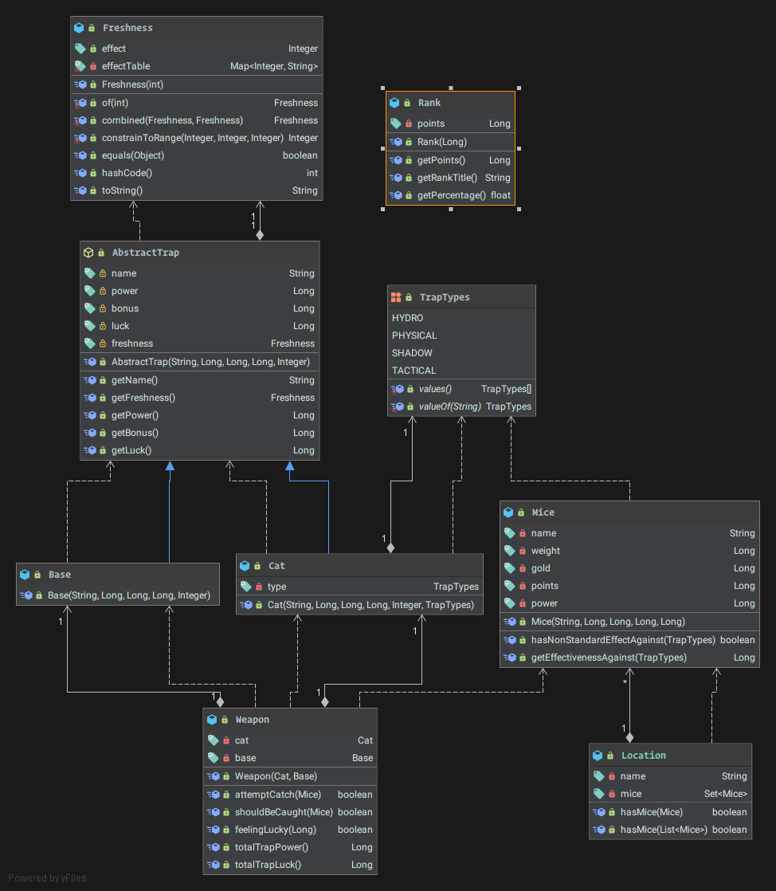

# Week 2

Only the "core" classes are displayed. Things like repositories, database tables (entities) are left out. As of right now, both `Base` and `Cat` extends from `AbstractTrap` as they are both "traps".

Because we are making use of Spring and its IoC container, most of these classes will get their own interface to encourage loose coupling + easy testability with mocks.

This week, the project's bare minimum skeleton is fleshed out. This includes but is not limited to:
- Frontend scaffolding (router, vuex)
- Feature + Unit tests
- CI with GH Actions
