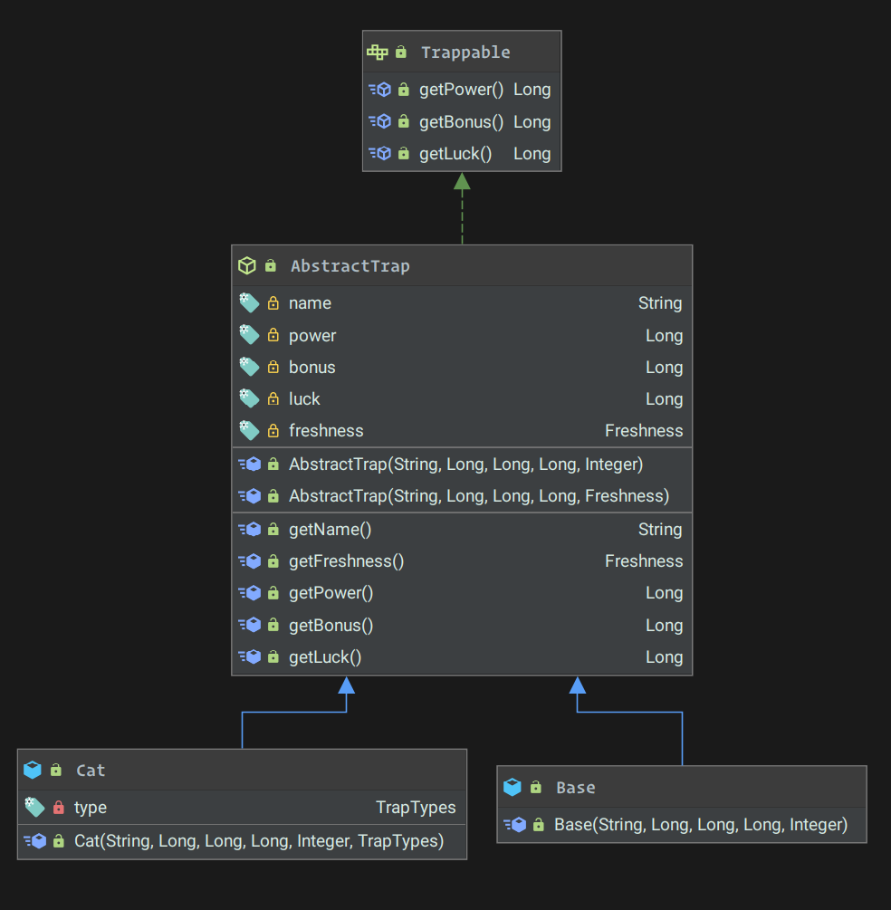
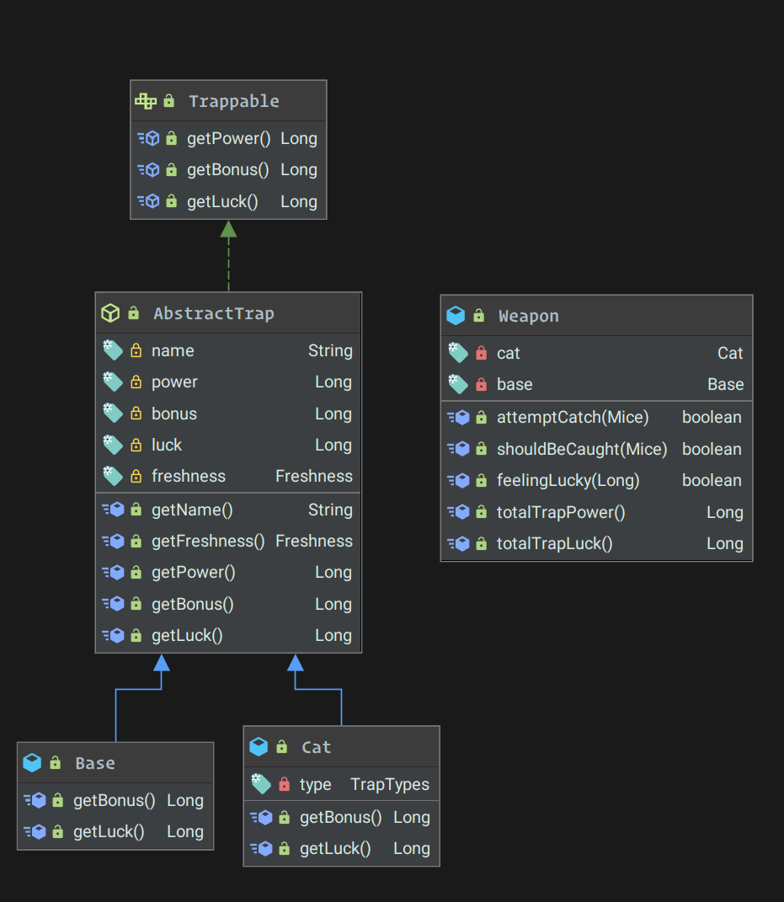

# Week 3

## Spring

### Inversion of Control (IoC)

IoC is a guiding principle, where the control flow of the program is *inverted*. Instead of creating and manually
manging objects (with `new`), we delegate the task to the framework. In this case, Spring's IoC Container.

Our code is written to depend on abstractions (interfaces). At runtime, when our code requires a certain service, the
concrete implementation will be resolved by the container.

#### Advantages

- The execution of a task is decoupled from its implementation
- Easily switch between modules (i.e. different database engines, easy test mocks)
- Prevent side effects when replacing a module (part of Liskov substitution principle - SOLID)

### Dependency Injection (DI)

The terms *Inversion of Control* and *Dependency Injection* are often used interchangeably (incorrectly). IoC can be
achieved through different patterns besides DI. The "Strategy" and "Service Locator" patterns are common examples.

When it comes to DI with Spring, there 3 ways to inject dependencies: Constructor, Setter and Field. We will be
predominantly using *Constructor Injection*.

```java
@Service
public class CarService {
    public Car(Engine engine, Transmission transmission) {
        this.engine = engine;
        this.transmission = transmission;
    }
}
```

In the above example, when we retrieve an instance of `CarService` from the container, the dependencies - Engine and
Transmission - will automatically be injected.

## Diagram



### Polymorphism



By default, AbstractTrap provides `getBonus` and `getLuck`: standard getter functions for their respective fields. A `Weapon` is made up of different components. These separate components have their own individual fields that represents a discrete statistic. 

They come together to form a total weight that will be factored into a formula to determine if a mouse should be "caught". Even though they have the same data type (Long), a Cat's `bonus` and `luck` has a *higher* weight compared to the standard. A base's `bonus` and `luck` is adjusted to be lower compared to the standard.

`Base` and `Cat` both override the default implementation on `AbstractTrap` to change the weightage of luck and power bonuses.

#### Files
- [Base](/src/main/java/moe/ksmz/rodentraid/sck/Domain/Base.java)
- [Cat](/src/main/java/moe/ksmz/rodentraid/sck/Domain/Cat.java)

### Abstract Classes

As explained previously, we have an `AbstractTrap` that all trap *parts* should extend from. They define a set of common fields and their respective getters. Right now, we only have two components that come together to form the unified `Weapon`.


#### Files
- [AbstractTrap](/src/main/java/moe/ksmz/rodentraid/sck/Domain/AbstractTrap.java)

### Interfaces

Because of the nature of IoC+DI, use of interfaces is a given. Instead of depending on concrete implementations, we will "type-hint" our constructors with interfaces instead. Specifying the concrete implementations is done through annotations.

Certain services will read in information from a file (location of mice, types of mice). The `Loadable` interface lets us know which services require a file to be read into memory. Because we are registering these services into the container, we can hook into the container's lifecycle events and automatically call `load()` for any service that requires it.


#### Files

- [Trappable](/src/main/java/moe/ksmz/rodentraid/sck/Domain/Contracts/Trappable.java)

##### Concrete

##### Contracts
- [Loadable](/src/main/java/moe/ksmz/rodentraid/sck/Service/Contracts/Loadable.java)
- [LocationManager](/src/main/java/moe/ksmz/rodentraid/sck/Service/Contracts/LocationManager.java)
- [MiceManager](/src/main/java/moe/ksmz/rodentraid/sck/Service/Contracts/MiceManager.java)
