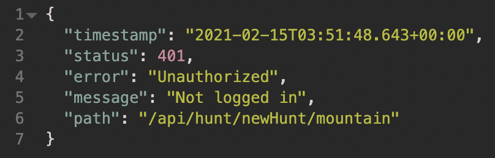

# Week 5

## Exception Handling

Exception handling is one of the most important feature of java programming that allows us to handle the runtime errors caused by exceptions.
By handling exceptions, we can provide a meaningful message to the user about the issue rather than a system generated message.

## Classes

Here are the example classes that demonstrates exception handling:
- [UnauthorizedException](/src/main/java/moe/ksmz/rodentraid/Auth/UnauthorizedException.java)
- [AuthInterceptor](/src/main/java/moe/ksmz/rodentraid/Auth/AuthInterceptor.java)
- [FreshnessTest](/src/main/java/moe/ksmz/rodentraid/Unit/FreshnessTest.java)
- [Freshness](/src/main/java/moe/ksmz/rodentraid/sck/Domain/Freshness.java)

### UnauthorizedException & AuthInterceptor
These two classes are responsible for identifying whether the user is logged in and responding with an appropriate error message if
the authentication fails.

To put it simply, every request will be checked at AuthInterceptor:
```
@Component
public class AuthInterceptor implements HandlerInterceptor {
    private final AuthStatus authStatus;

    public AuthInterceptor(AuthStatus authStatus) {
        this.authStatus = authStatus;
    }

    @Override
    public boolean preHandle(
            HttpServletRequest request, HttpServletResponse response, Object handler)
            throws Exception {
        if (authStatus.isLoggedIn()) {
            return true;
        }

        throw new UnauthorizedException();
    }
}
```

The most important part of this class is the preHandle method where 2 things can occur:
1. Throw UnauthorizedException if user is not logged in
2. Returns true if HTTP request is valid and the user is logged in

UnauthorizedException is a seperate class that uses the ResponseStatus annotation from SpringBoot:
```
@ResponseStatus(value = HttpStatus.UNAUTHORIZED, reason = "Not logged in")
public class UnauthorizedException extends RuntimeException {}
```

This gives us the ability to put in a desired response that we can display to the user when the exception hits:


### Freshness
The Freshness class, as the name suggests, is used to get, set and calculate the freshness of the bait that the users use in order to attract the mice.
The value of the freshness however, has to be between -6 and +6, because those values correspond to a specific effect as shown here:
```    
private static final Map<Integer, String> effectTable =
            Map.ofEntries(
                    entry(-6, "Über Stale"),
                    entry(-5, "Ultimately Stale"),
                    entry(-4, "Insanely Stale"),
                    entry(-3, "Extremely Stale"),
                    entry(-2, "Very Stale"),
                    entry(-1, "Stale"),
                    entry(0, "No Effect"),
                    entry(1, "Fresh"),
                    entry(2, "Very Fresh"),
                    entry(3, "Extremely Fresh"),
                    entry(4, "Insanely Fresh"),
                    entry(5, "Ultimately Fresh"),
                    entry(6, "Über Fresh"));
```

If the integer is not between that range, the constructor will throw an IllegalArgumentException with an appropriate response as shown here:
```    
public Freshness(int freshness) {
        if (freshness < -6 || freshness > 6) {
            throw new IllegalArgumentException("Freshness needs to be between -6 and +6");
        }

        this.effect = freshness;
    }
```

### FreshnessTest
On the other hand, the FreshnessTest class can be used to test various test cases using JUnit.
Here is an example:
```    
@Test
    void constrainToRange() {
        assertThat(Freshness.of(-9)).isEqualTo(Freshness.of(-6));
        assertThat(Freshness.of(9)).isEqualTo(Freshness.of(6));
        assertThat(Freshness.of(4)).isEqualTo(Freshness.of(4));
    }
```
